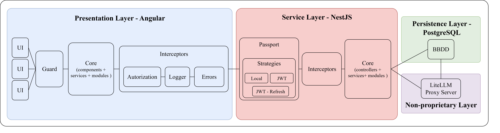
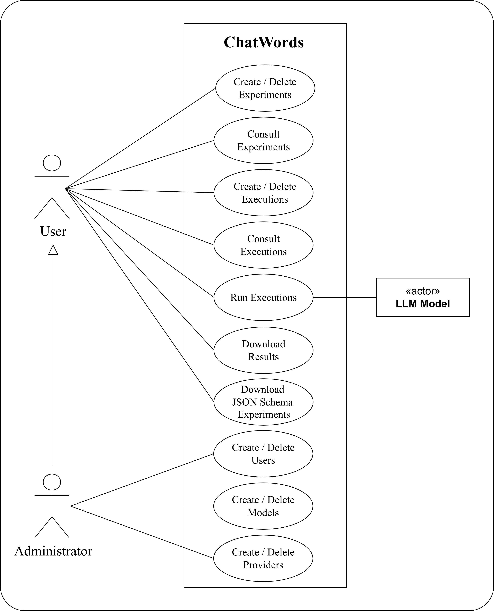
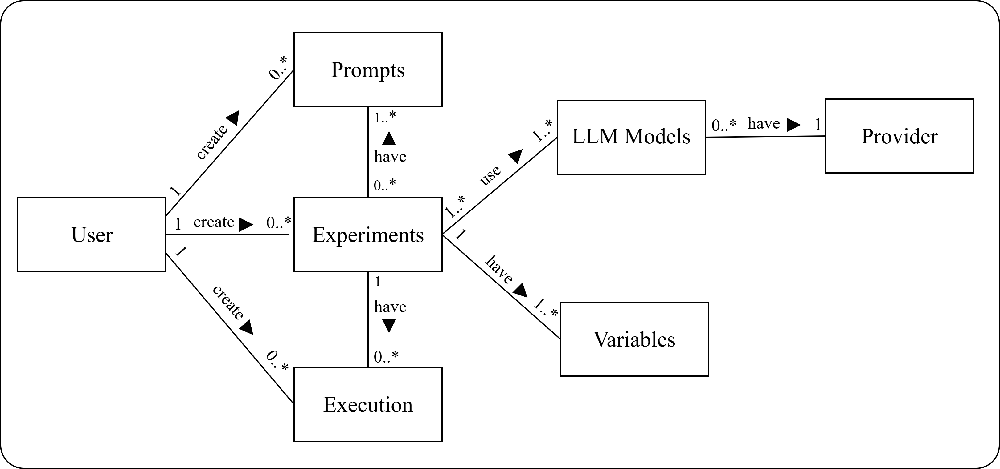

# ChatWords

[](https://github.com/WordsGPT/ChatWords)
[](https://github.com/WordsGPT/ChatWords/blob/main/LICENSE)
[](https://github.com/WordsGPT/ChatWords)
[](https://angular.io/)
[](https://nestjs.com/)


This project is a robust and scalable platform for the management and automation of experiments with **Large Language Models (LLMs)**. It allows users to create, parameterize, and run tests in a structured, efficient, and reproducible manner.

The tool is an expansion of the base project **ChatWords**, with the goal of being more accessible to users without programming knowledge. Experiments are defined with custom variables and prompts, and the results are logged in a database, facilitating the analysis and optimization of the models.

## Architecture
The platform follows a modular architecture:
- Angular frontend.
- NestJS backend with PostgreSQL.
- LiteLLM proxy for LLM provider abstraction.



## Use Case Diagram
The use case diagram provides an overview of the main functionalities of the system and how different actors interact with it.  
This type of diagram helps to identify the objectives users can achieve through the application, as well as the relationships between the different use cases and the actors involved.

The main actors of the application are the **User** and the **Administrator**.  
In the diagram, the **Administrator** inherits from the **User**, since they share the same use cases but add three additional functionalities exclusive to their role.  
As for the secondary actors, only the **LLM models** are included, which intervene during the execution of experiments by being queried to generate the corresponding responses.

<div align="center">
  
</div>

## Domain Model Diagram
The domain model represents a conceptual view of the main elements of the system.  
Its purpose is to describe the key entities, their attributes, and the relationships among them, without focusing on technical implementation or persistence details.

In this application, the domain model reflects the ecosystem where **users**, **experiments**, **prompts**, and **queries** interact with different **LLM providers and models**.  
This model serves as the foundation for the logical architecture, the database design, and the implementation of the use cases.

### Key Entities
- **User**: represents the people who interact with the system. A user can create experiments, queries, and prompts.  
- **Experiment**: the core of the application, defined by the user and composed of prompts and variables. Each experiment can generate multiple queries and run on different LLM models.  
- **Query**: represents each execution of an experiment in a specific context. A query belongs to a single experiment and is created by a user.  
- **Prompt**: textual statements that are part of experiments, generating responses when queries are executed. Prompts can be reused across experiments.  
- **Variable**: configurable parameters that customize the execution of experiments.  
- **LLM Model**: represents the language models used in experiments. Each model belongs to a specific provider and can be reused.  
- **Provider**: groups the LLM models offered by the same company or service (e.g., OpenAI, Anthropic).  

### Relationships
- A **User** can create multiple **Experiments**, **Queries**, and **Prompts**.  
- An **Experiment** has one or many **Prompts** and **Variables**, and can be linked to multiple **Queries**. Each experiment belongs to one **User**.  
- **Prompts** belong to a single **User**, but can be reused across multiple **Experiments**.  
- A **Query** belongs to one **User** and one **Experiment**.  
- A **Variable** always belongs to a single **Experiment**.  
- A **Provider** can offer multiple **LLM Models**, which can be associated with different **Experiments**.



## Requirements

Before getting started, make sure you have the following installed:

### System
- **Node.js** >= v20.17.0
- **Docker** >= v24.0.6
- **Docker Compose** >= v2.23.0
- **PostgreSQL** >= v17

### Frontend
- **Angular** >= v19.2

### Backend
- **NestJS** >= v11.0.7

## Installation

### Option 1: Deploy with Docker

This is the simplest way to get the platform running. Docker will handle all dependencies for you.

#### 1. **Clone the repository**:

```sh
  git clone https://github.com/WordsGPT/chatLab.git
  cd chatLab
```

All services (backend, frontend, PostgreSQL, LiteLLM proxy) will be automatically started.
No additional installation of Node.js, Angular, NestJS, or PostgreSQL is required.

#### 2. **Configure the LiteLLM `config.yaml`**:

Edit the `config.yaml` file inside the `litellm` folder.  
Use placeholders to fill in your values; this file is required to access the LiteLLM UI and to connect to LLM providers:

- `<your_model_alias>`: alias for the LLM model.
- `<your_model_name>`: name of the LLM model (e.g., `gpt-4.1-nano`).
- `<your_provider_api_key>`: API key for the selected LLM provider.
- `<db_user>`, `<db_password>`, `<db_host>`, `<db_port>`, `<db_name>`: PostgreSQL connection details.
- `<your_master_key>`: master key of the LiteLLM proxy server. You can use any value for the key (for example, `sk-1234`); these value is used both to access the LiteLLM UI and to make queries to the LLMs.

#### 3. **Configure PostgreSQL connection**:

Edit the `.env` file located in the backend folder and fill in the fields related to PostgreSQL.  
The file already contains default values configured for Docker Compose, so you just need to uncomment them if you want to use them.

- Make sure to use the same values as specified in the `config.yaml` file from step 2 to keep the database connection consistent.
- If you prefer to use your own PostgreSQL setup, update the variables accordingly.

#### 4. **Configure LLM providers**

To enable the use of different LLMs, you must configure their corresponding API keys, the `MODELS` variable, and the `LITELLM_MASTER_KEY` in the `.env` file at the backend folder.  
Make sure that the value of `LITELLM_MASTER_KEY` matches the one defined in step 3.
- **LITELLM_MASTER_KEY**: set the same value as in step 2.
- **API keys**: provide the API key of each LLM provider you want to use (e.g., OpenAI, Anthropic, etc.).  
- **MODELS**: define the available models following the format described in the comments of the `.env` file. You have to use the same values as those set in the `config.yaml` file from step 2.

#### 5. **Optional - Configure additional environment variables:**

You can also configure extra variables in the `.env` file at the backend folder. 
- **JWT Authentication**: set secret keys for signing Access and Refresh tokens.
- **Default Admin User**: define the credentials of the initial administrator account created in the system.

#### 6. **Build the services with Docker Compose**:

From the root folder of the project, run the following command to build all services (backend and frontend):

```sh
docker-compose --env-file ./backend/.env build
```

### Option 2: Local Setup

If you want to run the platform locally without Docker, make sure you have all the requirements listed in the **Requirements** section installed.  
To simplify the installation, a `package.json` has been added in the root folder, allowing you to install all dependencies for both backend and frontend from the root folder.

#### 1. **Clone the repository with submodules**:

```sh
  git clone --recurse-submodules https://github.com/WordsGPT/chatLab.git
  cd chatLab
```

> If you already cloned the repository without `--recurse-submodules`, you can initialize and update the submodules with:
>
> ```sh
> git submodule update --init --recursive
> ```

#### 2. **Install dependencies**:

```sh
  npm run install
```

> If you prefer, you can also install the backend and frontend dependencies individually from the root folder with:
>
> - Backend:
> ```sh
> npm run backend-install
> ```
>
> - Frontend:
> ```sh
> npm run frontend-install
> ```

#### 3. **Create a `.env` file for the LiteLLM proxy**:

Create a `.env` file inside the `litellm` folder with the following content. You can use any value for the keys (for example, `sk-1234` for both); these values are used both to access the LiteLLM UI and to make queries to the LLMs.

```env
LITELLM_MASTER_KEY=<your_master_key>
LITELLM_SALT_KEY=<your_salt_key>
```

#### 4. **Configure PostgreSQL connection**:

Check the `.env` file located in the backend folder.  
By default, it already includes the necessary variables to connect to PostgreSQL.  

- First, verify if the default values work in your local environment.  
- If not, update them according to your PostgreSQL configuration.

#### 5. **Configure LLM providers**

To enable the use of different LLMs, you must configure their corresponding API keys, the `MODELS` variable, and the `LITELLM_MASTER_KEY` in the `.env` file at the backend folder.  
Make sure that the value of `LITELLM_MASTER_KEY` matches the one defined in step 3.
- **LITELLM_MASTER_KEY**: set the same value as in step 3.
- **API keys**: provide the API key of each LLM provider you want to use (e.g., OpenAI, Anthropic, etc.).  
- **MODELS**: define the available models following the format described in the comments of the `.env` file.

#### 6. **Optional - Configure additional environment variables:**

You can also configure extra variables in the `.env` file at the backend folder. 
- **JWT Authentication**: set secret keys for signing Access and Refresh tokens.
- **Default Admin User**: define the credentials of the initial administrator account created in the system.

## Starting the Platform

### Option 1: Start with Docker

From the root folder of the project, simply run:

```sh
docker-compose --env-file ./backend/.env up
```

### Option 2: Start Locally

If you want to run the platform without Docker, you need to start both backend and frontend individually.  
To simplify the process, scripts have been added to the `package.json` in the root folder, allowing you to start the backend and frontend from the root without navigating into each folder.

#### 1. Start the backend

```sh
npm run backend-start:dev
```
This will start the NestJS backend in development mode.

#### 2. Start the frontend

```sh
npm run frontend-start:open
```

This will start the Angular frontend and automatically open it in your default browser.

#### 3. Start PostgreSQL

If you have PostgreSQL installed locally, it should already be running.
If not, start your local PostgreSQL server according to your system setup.

#### 4. Start the LiteLLM proxy

Open a new terminal and run:
```sh
cd litellm
docker-compose up
```

This will start the LiteLLM proxy service, allowing you to connect to your configured LLM providers.

> **Note:** For now, you will need to manually add the models defined in step 5 of the local installation through the LiteLLM proxy web interface.  
> This is a temporary step until the **Future Work** item regarding administrator use cases is implemented.

## Important Endpoints

Here are the main endpoints you will likely use during development and testing:

<div align="center">

| URL | Description |
| --- | ----------- |
| `http://localhost:4200` | Angular frontend UI of the application. |
| `http://localhost:3000/swagger` | Swagger documentation for the NestJS backend API. |
| `http://localhost:4000` | Swagger documentation for the LiteLLM proxy API. |
| `http://localhost:4000/ui` | LiteLLM proxy UI. |

</div>

## Future Work

The following enhancements and features are planned for future versions of the platform:

- **Frontend internationalization**: Implement multi-language support using tools such as Localize.  
- **Sidebar navigation**: Add a collapsible sidebar to improve navigation as the application grows.  
- **Administrator use cases**: Complete the implementation of administrator-specific functionalities, some of which are already partially implemented in the backend.  
- **Admin dashboard**: Provide a dashboard to visualize metrics such as active users and most-used models.  
- **Structured object validation**: Manage validations via schemas to cover more complex use cases in a structured manner.  
- **Separate LLM configuration**: Move LLM configurations to a dedicated table for better management.  
- **Multiple execution formats**: Allow experiment runs to export results not only in JSON, but also in CSV or Excel.  
- **Parameterized prompts**: Extend prompts to accept parameters within the statements.  
- **Improved concurrent execution**: Enhance concurrency management beyond global `Promise.all`, potentially handling it at the question level.  
- **Stop ongoing executions**: Add the ability to stop experiments that are currently running.  
- **Virtual keys in LiteLLM**: Enable segmentation of model usage by user or entity.  
- **Multimodal support**: Expand the platform to handle multimodal inputs (e.g., images), overcoming current LiteLLM limitations.
